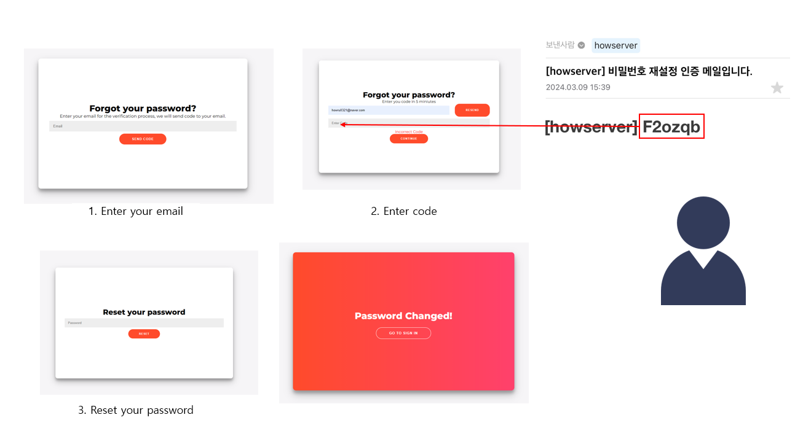
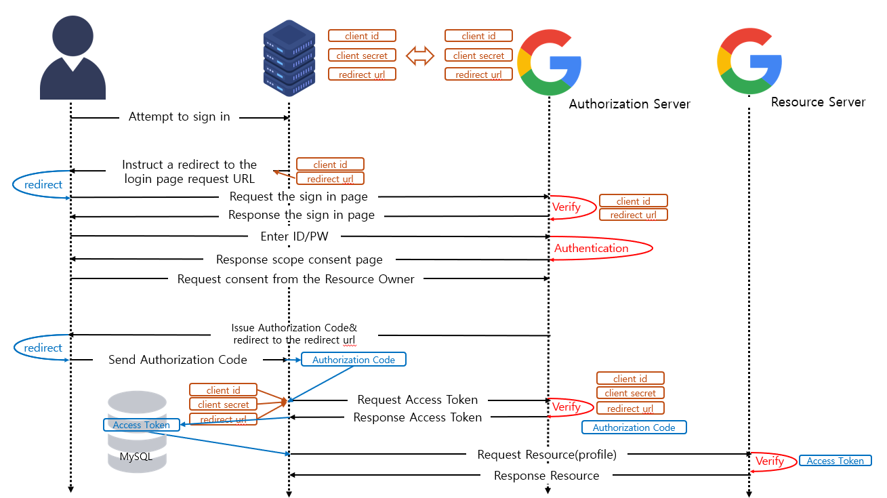

# login project
> development period : 2024.01.20 - 2024.03.06

## introduction
### Purpose of the Project
The primary goal of this project is to foster a comprehensive understanding of fundamental login logic, encompassing concepts such as access tokens, refresh tokens, and MySQL integration. By delving into the intricacies of these components, developers can gain valuable insights into secure authentication processes.

### Key Features
- JWT-based Authentication: I've implemented a authentication process using JSON Web Tokens (JWT). Both access tokens and refresh tokens have been meticulously crafted to enhance security and user experience.

- Login Logic: Beyond a basic grasp of login processes, this project offers a detailed exploration of various facets, including access token and refresh token concepts.

- Password Recovery: In addition to the login workflow, I've developed a logic for handling password recovery. Users who forget their passwords can seamlessly initiate the recovery process through email verification.

## Requirements
- Node.js v20.11.0
- npm 10.2.4

## Page

| Sign In             | Sign up       |
|---------------------|----------------------|
|  |  |

|Forgot Password|
|---------------|
|  |

## Database Usage
In this project, My project leverage three crucial databases to efficiently manage user information and facilitate secure authentication processes.

### MySQL
MySQL serves as the primary database for storing user information. This includes essential details required for user authentication and management.

### Redis (Local)
For local operations, My project employ Redis to store user email as the key and its corresponding refresh token as the value. This setup ensures that each user is assigned a unique refresh token, enhancing security and preventing token misuse.

### Redis (Cloud)
In the cloud environment, Redis comes into play for storing temporary values during the password recovery process. Specifically, My project use Redis to save user email as the key and the authentication code as the value. Given the transient nature of these values, Redis proves to be a suitable choice. Additionally, My project set a validity period of 5 minutes to ensure timely and secure verification during the password recovery process.

## Authentication Flow
### Token Flow

### OAuth2.0(google) Flow

## Security Highlights
My login server implementation prioritizes robust security measures to safeguard user data and enhance overall system integrity. Here are key security features that contribute to the project's resilience against potential threats:

### 1. Protection Against SQL Injection
My project employ parameterized queries to mitigate the risk of SQL injection attacks. By utilizing parameterized queries, My project ensure that user input is properly sanitized, preventing malicious SQL code injection and enhancing the security of our database interactions.

### 2. Refresh Token Rotation
To bolster security, My project implement refresh token rotation. When an access token expires and a valid refresh token is present, both the access token and refresh token are reissued. This proactive approach ensures that even if a refresh token is compromised, its lifespan is limited, minimizing the window of vulnerability.

### 3. Unique Refresh Token per User
Our server architecture, leveraging Redis, stores refresh tokens in a secure manner, ensuring that each user is assigned a unique refresh token. By associating refresh tokens with user emails (key-value pair: email-refresh token), My project enhance security. This design choice enables the server to invalidate compromised refresh tokens efficiently, significantly improving the overall security posture.

#### Stateless Token Trade-off
While traditional token-based systems embrace statelessness, My project make a deliberate trade-off for heightened security. Opting for a stateful approach allows us to promptly detect and invalidate compromised refresh tokens, enhancing our ability to respond to potential security threats.

#### one-to-one relationship between users and refresh tokens
 In the event of a hacker acquiring a refresh token, the server faces the challenge of reissuing a new token to the legitimate user while invalidating the compromised one. 
By opting for a one-to-one relationship between users and refresh tokens, my project restrict users to one valid refresh token at a time. If a user logs in from a different browser or device, the existing session is terminated (from the moment the access token expires), bolstering security even at the cost of some user convenience.